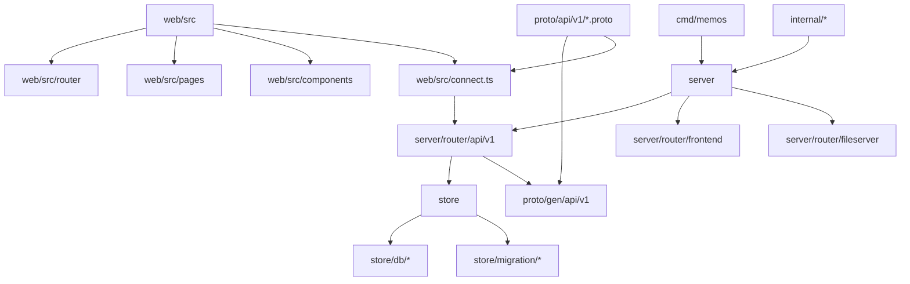
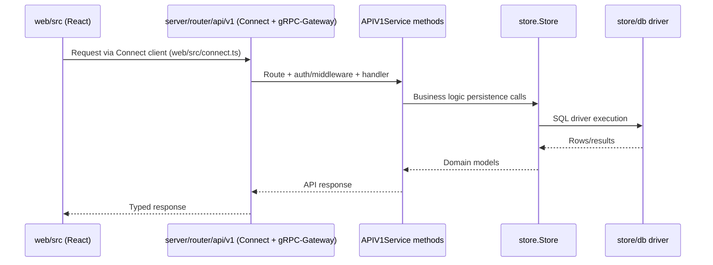

# Boilerplate Scaffold Guide

This document maps the repository so it can be reduced to a reusable scaffold for future projects.

## 1) High-level project structure

## 2) Core directories and intended scaffold role

| Path | Role in current repo | Keep for boilerplate? |
| --- | --- | --- |
| `/tmp/workspace/varsnotwars/memos/cmd/memos` | App entrypoint and runtime bootstrap | Keep |
| `/tmp/workspace/varsnotwars/memos/server` | HTTP server composition, route registration, background runners | Keep |
| `/tmp/workspace/varsnotwars/memos/store` | Storage abstraction + DB drivers + migrations | Keep |
| `/tmp/workspace/varsnotwars/memos/proto` | API contracts and generated client/server types | Keep |
| `/tmp/workspace/varsnotwars/memos/web/src` | React app shell, routing, API clients, feature UI | Keep (trim feature-specific pages/components) |
| `/tmp/workspace/varsnotwars/memos/internal` | Shared runtime packages (profile, utils, markdown, etc.) | Keep selectively |
| `/tmp/workspace/varsnotwars/memos/docs/plans` | Historical implementation plans | Remove from scaffold output |

## 3) Runtime architecture

## 4) How to strip this repo to boilerplate

1. Keep the platform skeleton:
   - Entrypoint (`cmd/memos`)
   - Server composition (`server/server.go`)
   - Routing framework (`server/router/*`)
   - Store abstraction and DB plumbing (`store/*`)
   - Frontend shell (`web/src/App.tsx`, `web/src/router`, layout scaffolding)
   - Build/test/tooling files (`go.mod`, `web/package.json`, CI workflows)
2. Remove product-specific features in vertical slices:
   - Memos domain handlers/services
   - Memos UI pages/components
   - Domain-specific proto services/messages
3. Keep one minimal reference feature end-to-end (API + store + page) as an example slice.
4. Rename modules, env vars, branding, and route constants to neutral scaffold naming.
5. Reset migrations and seed data to a minimal baseline schema for the new project.

## 5) How to add new features on top of the scaffold

### Backend feature path
1. Define or extend API contract in `/tmp/workspace/varsnotwars/memos/proto/api/v1/*.proto`.
2. Implement server behavior in `/tmp/workspace/varsnotwars/memos/server/router/api/v1`.
3. Add persistence methods/models under `/tmp/workspace/varsnotwars/memos/store`.
4. Add DB migration updates in `/tmp/workspace/varsnotwars/memos/store/migration/*`.
5. Add backend tests near touched packages (`server/router/api/v1`, `store`, `internal`).

### Frontend feature path
1. Add/extend typed client usage in `/tmp/workspace/varsnotwars/memos/web/src/connect.ts` consumers.
2. Add page/component modules under `/tmp/workspace/varsnotwars/memos/web/src/pages` and `components`.
3. Register route(s) in `/tmp/workspace/varsnotwars/memos/web/src/router/index.tsx` and constants in `routes.ts`.
4. Add UI tests in existing Vitest test locations alongside changed components.

### Validation workflow
1. Backend: `go test ./...`
2. Frontend: `cd web && pnpm lint && pnpm test && pnpm build`
3. Ensure CI workflows remain green for backend, frontend, and proto checks.

